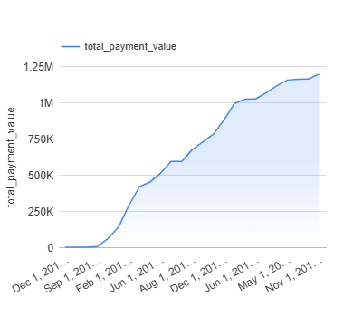
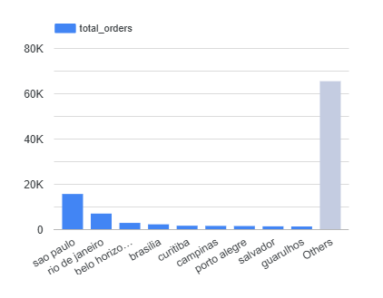
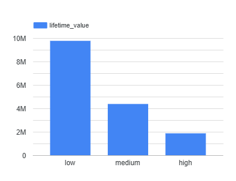

# E-commerce ELT Pipeline

End-to-end ELT pipeline built with **Airflow**, **dbt**, and **BigQuery** on the Brazilian Olist e-commerce dataset (100K+ orders).

## Architecture

Raw Data → Airflow (Extract + Load) → BigQuery (Raw) → dbt (Transform) → Mart Tables → Looker Studio

## Tech Stack

| Layer | Tool |
|---|---|
| Orchestration | Apache Airflow |
| Transformation | dbt (staging → intermediate → mart) |
| Data Warehouse | Google BigQuery |
| Visualization | Looker Studio |
| Language | Python, SQL |

## Pipeline

Airflow DAG runs on schedule with 3 tasks:

`extract_load_to_bigquery` → `dbt_run` → `dbt_test`

**Datasets in BigQuery:**
- `ecommerce_raw` — 6 tables, 99,441 orders
- `ecommerce_raw_intermediate` — joined and cleaned models
- `ecommerce_raw_mart` — `mart_sales_summary`, `mart_customer_ltv`

## Dashboard

🔗 [View Live Dashboard](https://datastudio.google.com/reporting/1fca8831-8f88-4443-8583-d1c4a4c732eb)

### Monthly Revenue Trend

### Top Cities by Revenue

### Customer LTV by Segment

## Dataset

[Brazilian E-commerce by Olist](https://www.kaggle.com/datasets/olistbr/brazilian-ecommerce) — 100K orders, 2016–2018
